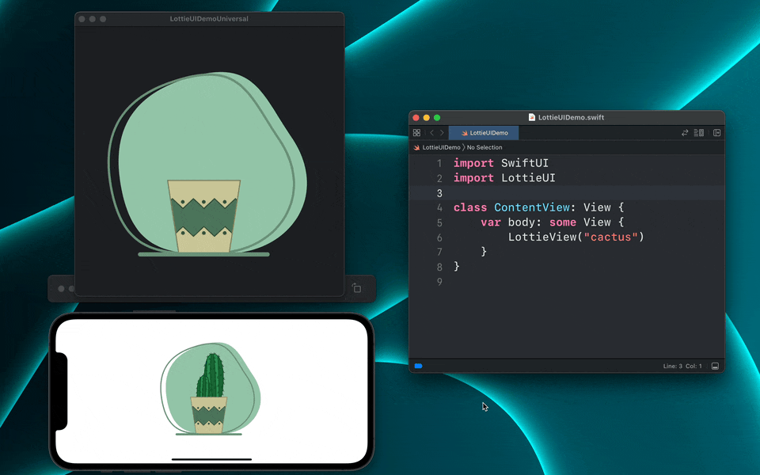

# LottieUI



LottieUI allows you to use delightful [Lottie](https://airbnb.design/lottie/) animations with SwiftUI without having to give up on the familiar delcarative API or the powerful customization settings from the animation framework

### ☑️ Requirements

- iOS 13.0 or later
- macOS Catalina 10.15 or later *NEW* (Requires LottieUI 1.1 or later)

# 🧑‍💻 Usage

To display an animation from a local Lottie JSON file, use the `LottieView` component:

```swift
LottieView("MyAnimation")
```

If your JSON is stored on another bundle outside your project's, you can specify the Bundle to load the animatio from or provide a file path where the animation file is located:

```swift
// Loads an animation from the provided bundle
LottieView("MyAnimation", bundle: DesignSystem.Bundle.main)
// Loads an animation file from the provided path
LottieView(path: "/path/to/animation.json")
```


## 🛰 Remote animations

For remote animations, LottieUI provides AsyncLottieView, which attemps to download an animation from a remote URL and present it if successful. You can also provide views to be displayed while the donwload is in progress or if the download fails:

```swift
let url = URL(string: "https://assets3.lottiefiles.com/packages/lf20_hbdelex6.json")!

AsyncLottieView(url: url) { phase in
    switch phase {
    case .loading:
        ProgressView()
    case .error:
        ErrorView
    case .success(let lottieView):
        lottieView
    }
}
```

# 🚀 Features

LottieView allows you to take control of your animations with a set of modifiers that can be applied to a LottieView:

## ⏯ Playback

By default, your animation will start playing automatically. To control whether the animation should be playing, use the `.play(_:)` modifier:

```swift
struct ContentView: View {
    @State var isPlaying: Bool = true
    
    var body: some View {
        LottieView("MyAnimation")
            .play(isPlaying)
    }
}
```


## 🔁 Loop Mode

To setup the Loop Mode for your animation, use `.loopMode(_:)`

```swift
struct ContentView: View {
    var body: some View {
        LottieView("MyAnimation")
            .loopMode(.loop)
    }
}
```


## 🖼 Current Frame and Progress

To observe the current frame beign displayed in the animation and perform an action based on it, use `.onFrame(_:)`

```swift
struct ContentView: View {
    var body: some View {
        LottieView("MyAnimation")
            .onFrame { _ in
                // Perform action based on current frame
            }
    }
}
```

To observe the progress instead, use `.onProgress(_:)`:

```swift
struct ContentView: View {
    var body: some View {
        LottieView("MyAnimation")
            .onProgress { _ in
                // Perform action based on current progress
            }
    }
}
```


> **Warning**
> Progress and frame observers are only available on iOS

## 🏃 Speed

To set the speed of an animation, use `.speed(_:)`:

```swift
struct ContentView: View {
    var body: some View {
        LottieView("MyAnimation")
            .speed(2.0)
    }
}
```


## Rendering Engine

LottieUI also supports the new RenderingEngine introduced in [Lottie 3.4.0](https://github.com/airbnb/lottie-ios/discussions/1627), which can greatly reduce CPU usage when displaying compatible animations

By default, LottieUI will the `.automatic`, which will automatically apply the new rendering engine if an animation is compatible, but you can override it with the `.renderingEngine(_:)` modifier:

```swift
LottieView("MyAnimation")
    .renderingEngine(.coreAnimation)
```


There are many other options available such as:

- Limit the framerate of an animation with `.play(fromFrame:to:)`
- Define the background behavior of the animation with `.backgroundBehavior(_:)`
- Set the value provider for a specific keypath of the animation with `.valueProvider(_: keypath:)`

For more information check the included documentation in each public component and modifier

# 🛠 Installation

## Swift Package Manager

In your project's `Package.swift` file, add `LottieUI` as a dependency:
```swift
.package(name: "LottieUI", url: "https://github.com/tfmart/LottieUI", from: "1.0.0")
```
